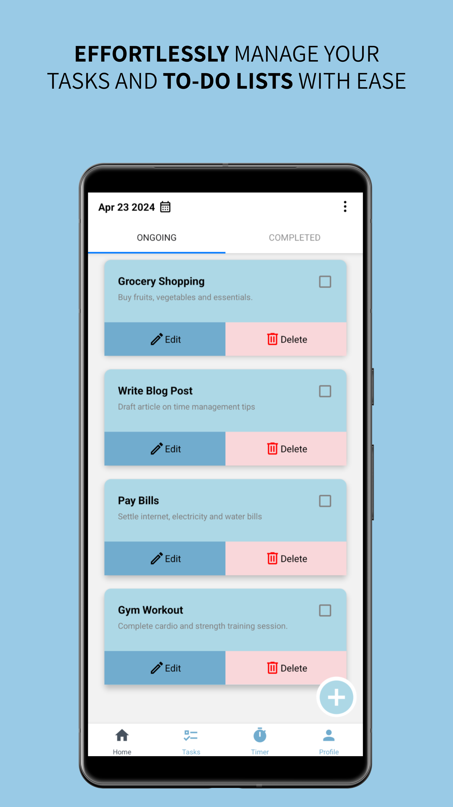
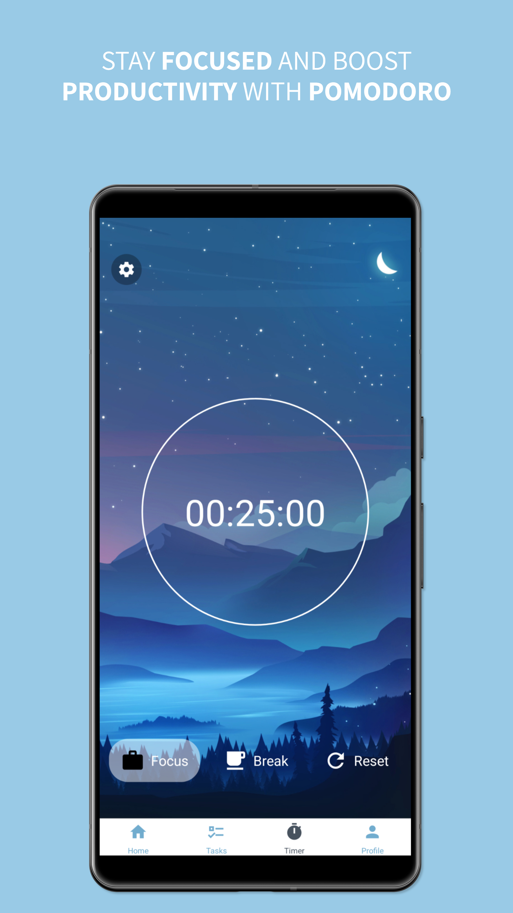
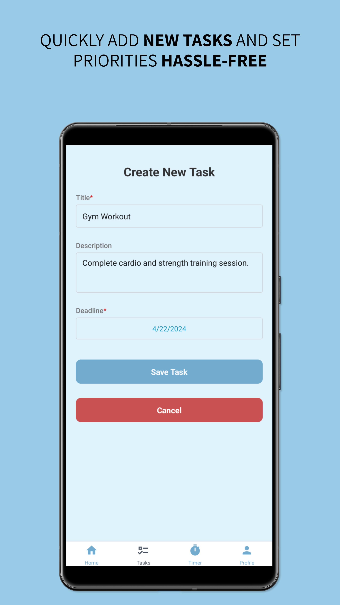
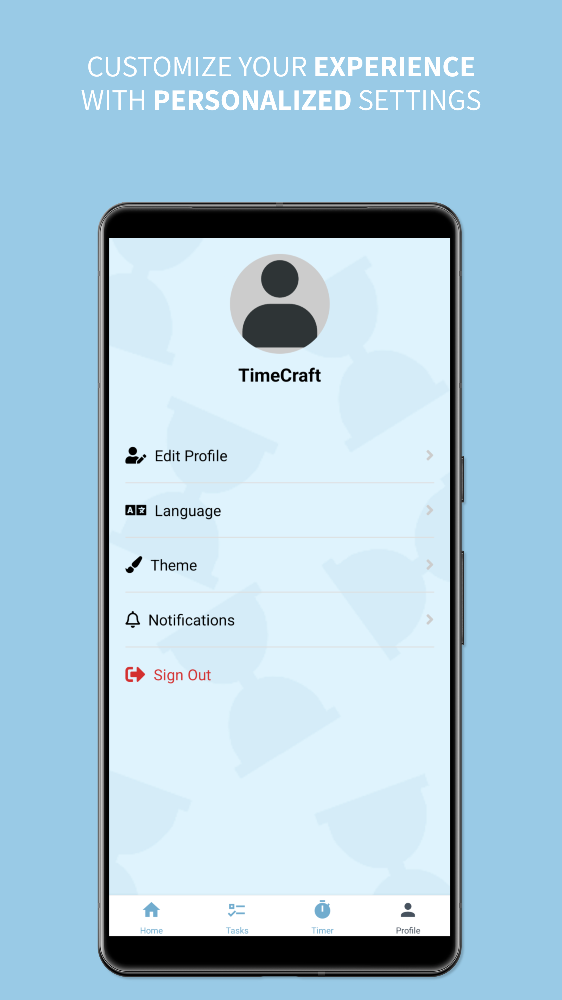
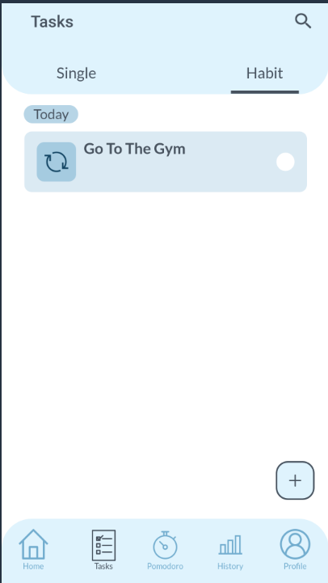
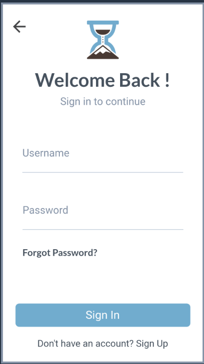
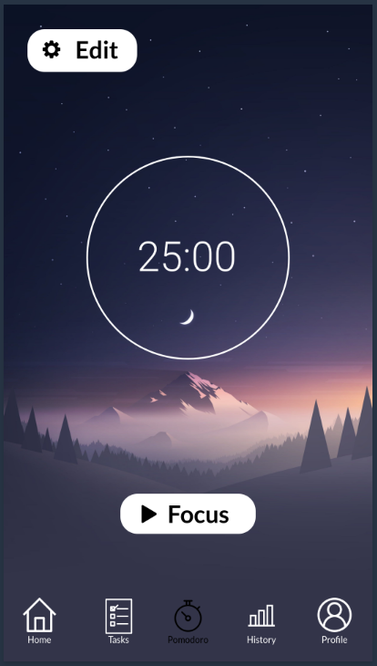
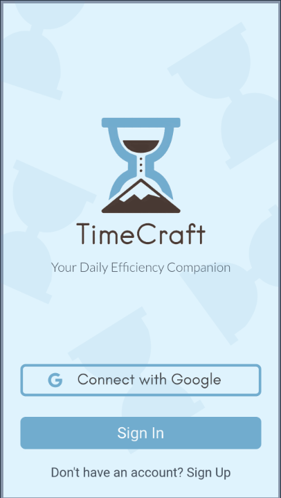
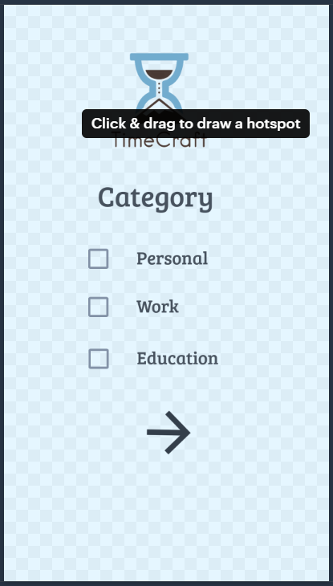

# TimeCraft — Your Daily Efficiency Companion

Effortlessly manage tasks, stay focused with Pomodoro, build habits, and understand where your time goes — all in one beautiful mobile app.

> **Note:** This project was created for **CSE 5320 STSE** (University of Texas at Arlington).

---

## Table of Contents
- [Features](#features)
- [Screenshots](#screenshots)
- [Tech Stack](#tech-stack)
- [Architecture](#architecture)
- [Getting Started](#getting-started)
- [Configuration](#configuration)
- [Run](#run)
- [Testing](#testing)
- [Roadmap](#roadmap)
- [Contributing](#contributing)
- [License](#license)
- [Acknowledgments](#acknowledgments)

---

## Features

- **Tasks & To‑Dos** – Create, edit, delete tasks with due dates and notes.
- **Pomodoro Focus Timer** – Flexible focus/break cycles with a clean, distraction‑free UI.
- **Habits** – Track recurring actions (e.g., “Go to the gym”) with quick toggles.
- **History & Insights** – Review what you completed and when (foundation for analytics).
- **Profiles & Settings** – Edit profile, theme, language, and notifications.
- **Google Sign‑In** – Secure, one‑tap authentication via Firebase.
- **Clean, modern UX** – Color‑coded cards, bottom‑tab navigation, friendly microcopy.

---

## Screenshots

> Place images inside `docs/screenshots/` in your repo and keep the same filenames (or update the paths below).

| Screen | Image |
|---|---|
| Tasks & Lists |  |
| Pomodoro |  |
| Create Task |  |
| Profile & Settings |  |
| Habit Task |  |
| Sign In |  |
| Focus |  |
| Welcome / Onboarding |  |
| Category Onboarding |  |

---

## Tech Stack

- **React Native** (iOS & Android)
- **Expo** (recommended) or **React Native CLI**
- **Firebase** (Auth, Firestore/RTDB, Storage)
- **State Management**: Redux Toolkit or Zustand
- **TypeScript** (recommended)

---

## Architecture

```
app/
  navigation/        # bottom tabs & stacks (Home, Tasks, Pomodoro, History, Profile)
  screens/           # Tasks, TaskForm, Pomodoro, History, Profile, Auth
  components/        # TaskCard, HabitToggle, Timer, etc.
  store/             # Redux slices or Zustand stores
  services/          # firebase.ts, auth.ts, tasks.ts, habits.ts
  hooks/             # useAuth, useTimer, useTasks
  utils/             # date/time helpers, constants
  assets/            # icons, fonts, images (non-screenshot)
```

**Suggested data model**
- `users/{uid}`
- `tasks/{taskId}` → `{ title, description, dueDate, status, userId, createdAt }`
- `habits/{habitId}` → `{ name, cadence, lastCheckedAt, userId }`
- `sessions/{sessionId}` → Pomodoro session logs

---

## Getting Started

### Prerequisites
- Node.js LTS and npm (or yarn/pnpm)
- Expo CLI **or** React Native CLI
- Android Studio / Xcode (for emulators/simulators)
- A Firebase project (enable Email/Password and Google providers)

### Clone & Install
```bash
git clone https://github.com/Mohammed-Omair/TimeCraft.git
cd TimeCraft
npm i
# or: yarn
```

---

## Configuration

Create a `.env` file in the project root and add your Firebase keys:

```env
FIREBASE_API_KEY=xxx
FIREBASE_AUTH_DOMAIN=xxx.firebaseapp.com
FIREBASE_PROJECT_ID=xxx
FIREBASE_STORAGE_BUCKET=xxx.appspot.com
FIREBASE_MESSAGING_SENDER_ID=xxx
FIREBASE_APP_ID=1:xxxx:web:xxxx
FIREBASE_MEASUREMENT_ID=G-xxxx
```

- Initialize Firebase in `services/firebase.ts` by reading from environment variables.
- **Google Sign‑In**
  - Enable Google provider in Firebase Console.
  - **iOS**: Add reversed client ID in `app.json` / `Info.plist`.
  - **Android**: Add SHA‑1/256 keys to Firebase project settings.

---

## Run

```bash
# Expo (recommended for development)
npx expo start

# React Native CLI
npm run android
npm run ios
```

---

## Testing

- **Unit**: Jest + React Native Testing Library for components, hooks, and utils.
- **Integration**: Auth flow, task CRUD, timer start/stop.
- **E2E**: Detox for primary happy paths (optional).

---

## Roadmap

- [ ] Task categories, priorities, and reminders
- [ ] Calendar view & “Due Soon” smart lists
- [ ] Habit streaks and trend charts
- [ ] Analytics dashboard (weekly/monthly time usage)
- [ ] Offline‑first sync & conflict handling
- [ ] Theming (light/dark/system) & accessibility improvements

---

## Contributing

1. Fork the repo and create a feature branch.
2. Follow folder conventions and lint rules.
3. Add tests where reasonable.
4. Open a PR with a concise description, screenshots, and verification steps.

---

## License

MIT (add a `LICENSE` file in the repository if not already present).

---

## Acknowledgments

- Designed and developed as part of **CSE 5320 STSE** at the **University of Texas at Arlington**.
- Thanks to open‑source libraries and the React Native community.
